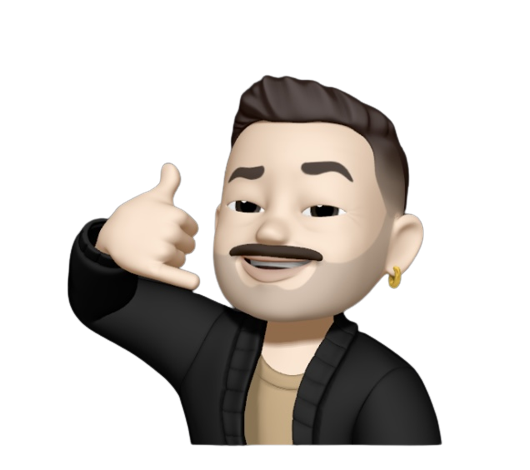

# 👋 Hi! I'm João Lima and I'm a full stack web developer!

## About
I'm from Brazil 🇧🇷 and I'm 25 years old. I've been learning web development since October/2021, when I had deciced to transition my career into tech. \
Also: \
   • I ❤️ cycling! I pedal at least 120km/week! 🚴; \
   • Music production is my passion! I used to make hip-hop instrumentals! 🹠\
   • Thrillers are my favorite ones when it comes to movies & series! 🍿🎥;

My current goal is to get a job as a developer to acquire experience, through the learning of new workflows and technologies 👨‍💻. \
Feel free to contact me through the links below. ⤵️
 

  
  
  

<!--   -->

## Tech Stack

|   |   |
|:--|:---:|
|`languages`|     |

|    |   |
|:---|:---:|
| `frameworks,libraries and platforms` | `what i've learned so far/use in a daily basis` |
| `frontend` |  |
| `state management`|  | 
| `styling` |   |
| `backend` |    |
| `orm` |  |
| `database`|  |
|`testing` |    |
| `ìde`|  |
| `containerization`|  |

|    |   |
|:---|:---:|
|`currently learning`|    |

Regarding future goals, my interests range from web development to mobile development; \
I pretend to learn technologies such as ReactNative and Flutter.

I've been looking up VR/AR applications development as well, since its using have been increasing throughout last years.

Since I'm still improving my skills, I'm open to tips and advices concerning my repositories/projects!
